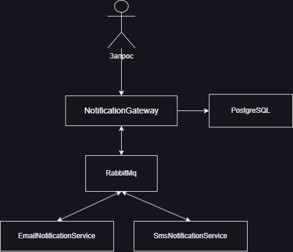
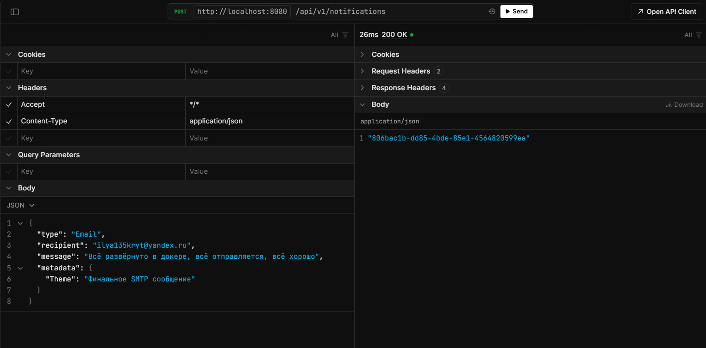
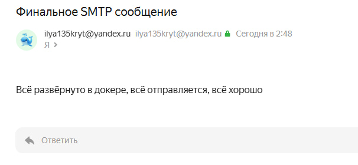
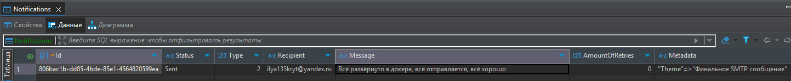
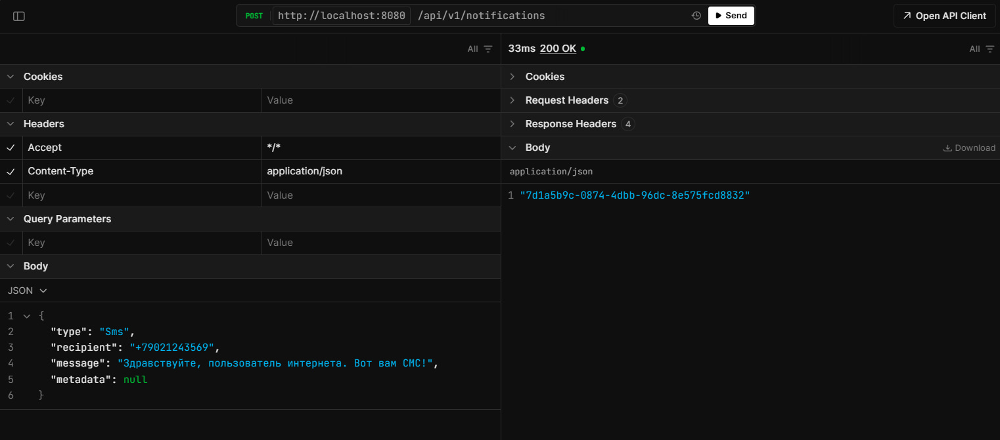
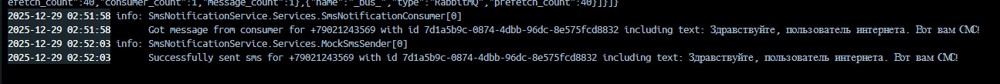
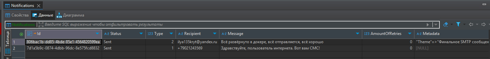

# DistributedNotificationService

## Описание проекта
Сервис предназначен для асинхронной отправки уведомлений через различные каналы.

## 📌 Оглавление
- [Архитектура системы](#архитектура-системы)
- [Технологический стек](#технологический-стек)
- [Структура проекта](#структура-проекта)
- [API](#api)
- [Запуск](#запуск)
- [Как добавить новый канал](#как-добавить-новый-канал)
- [Скриншоты](#скриншоты)

## Архитектура системы
Система построена по микросервисной архитектуре с общением через брокер сообщений.



### Компоненты:
- **NotificationGateway** (.NET) — основной шлюз, принимает запросы, маршрутизирует, управляет ретраями и сохраняет состояние в БД.
- **EmailNotificationService** (Go) — отправляет email через SMTP (проверено через Яндекс SMTP).
- **SmsNotificationService** (.NET) — моковая отправка SMS (логирование).
- **RabbitMQ** — брокер сообщений для асинхронной коммуникации.
- **PostgreSQL** — база данных для хранения статусов уведомлений.

## Технологический стек

| Компонент               | Технологии                          |
|-------------------------|-------------------------------------|
| NotificationGateway     | .NET 9, EntityFramework, MassTransit, Scalar |
| EmailNotificationService| Go 1.24.2, gomail.v2, amqp091-go   |
| SmsNotificationService  | .NET 9, MassTransit                 |
| Инфраструктура          | Docker, Docker Compose, RabbitMQ, PostgreSQL |

## Структура проекта
```
├── 📝 .dockerignore
├── 📝 .editorconfig
├── 📝 .env
├── 📝 .gitignore
├── 📝 DistributedNotificationService.sln
├── 📄 DistributedNotificationService.sln.startup.json
├── 📝 docker-compose.yaml
├── 📁 EmailNotificationService/
│   ├── 📝 .dockerignore
│   ├── 📁 configs/
│   │   └── 📄 appsettings.json
│   ├── 📝 Dockerfile
│   ├── 📝 go.mod
│   ├── 📝 go.sum
│   ├── 📁 internal/
│   │   ├── 📁 dtos/
│   │   │   ├── 📝 broker-response-dto.go
│   │   │   └── 📝 email-notification.go
│   │   └── 📁 services/
│   │       ├── 📝 config_loader.go
│   │       └── 📝 email_sender.go
│   └── 📝 main.go
├── 📁 NotificationGateway/
│   ├── 📝 .dockerignore
│   ├── 📄 appsettings.Development.json
│   ├── 📄 appsettings.json
│   ├── 📁 Consumers/
│   │   ├── 📄 EmailResultConsumer.cs
│   │   ├── 📄 EmailResultConsumerDefinition.cs
│   │   ├── 📄 SmsResultConsumer.cs
│   │   └── 📄 SmsResultConsumerDefinition.cs
│   ├── 📁 Controllers/
│   │   ├── 📄 HealthcheckController.cs
│   │   └── 📄 NotificationsController.cs
│   ├── 📁 Database/
│   │   ├── 📄 DatabaseContext.cs
│   │   ├── 📁 Migrations/
│   │   │   ├── 📄 20251228123747_InitialCreate.cs
│   │   │   ├── 📄 20251228123747_InitialCreate.Designer.cs
│   │   │   └── 📄 DatabaseContextModelSnapshot.cs
│   │   ├── 📁 Models/
│   │   │   └── 📄 NotificationModel.cs
│   │   └── 📁 Repositories/
│   │       └── 📄 NotificationRepository.cs
│   ├── 📝 Dockerfile
│   ├── 📁 Dtos/
│   │   ├── 📄 BrokerResponseDto.cs
│   │   ├── 📄 SendNotificationRequest.cs
│   │   └── 📁 Sms/
│   │       ├── 📄 EmailNotificationMessage.cs
│   │       └── 📄 SmsNotificationMessage.cs
│   ├── 📁 Enums/
│   │   ├── 📄 NotificationTypeEnum.cs
│   │   └── 📄 StatusEnum.cs
│   ├── 📁 Handlers/
│   │   ├── 📄 EmailNotificationHandler.cs
│   │   └── 📄 SmsNotificationHandler.cs
│   ├── 📁 Helpers/
│   │   └── 📄 EnumHelper.cs
│   ├── 📁 Interfaces/
│   │   ├── 📄 INotificationHandler.cs
│   │   ├── 📄 INotificationHandlersFactory.cs
│   │   ├── 📄 INotificationMessage.cs
│   │   ├── 📄 INotificationPublisher.cs
│   │   └── 📄 INotificationRepository.cs
│   ├── 📝 NotificationGateway.csproj
│   ├── 📝 NotificationGateway.csproj.user
│   ├── 📄 NotificationGateway.sln.startup.json
│   ├── 📄 Program.cs
│   ├── 📁 Properties/
│   │   └── 📄 launchSettings.json
│   └── 📁 Services/
│       ├── 📄 NotificationHandlersFactory.cs
│       └── 📄 NotificationPublisher.cs
├── 📝 README.md
└── 📁 SmsNotificationService/
    ├── 📝 .dockerignore
    ├── 📁 Abstractions/
    │   └── 📄 ISmsSender.cs
    ├── 📄 appsettings.Development.json
    ├── 📄 appsettings.json
    ├── 📁 Consumers/
    │   ├── 📄 SmsNotificationConsumer.cs
    │   └── 📄 SmsNotificationConsumerDefinition.cs
    ├── 📝 Dockerfile
    ├── 📁 Dtos/
    │   ├── 📄 BrokerResponseDto.cs
    │   └── 📄 SmsNotification.cs
    ├── 📁 Enums/
    │   ├── 📄 SendSmsStatusEnum.cs
    │   └── 📄 StatusEnum.cs
    ├── 📄 Program.cs
    ├── 📁 Properties/
    │   └── 📄 launchSettings.json
    ├── 📁 Services/
    │   └── 📄 MockSmsSender.cs
    ├── 📝 SmsNotificationService.csproj
    └── 📝 SmsNotificationService.csproj.user
```
## API
**POST** `/api/v1/notifications`

Пример запроса для email:
```json
{
  "type": "Email",
  "recipient": "test@example.com",
  "message": "Пример для почты",
  "metadata": {
        "Theme": "Проект по микросервисам на C#"
    }
}
```
Пример запроса для SMS:
```json
{
  "type": "Sms",
  "recipient": "+79999999999",
  "message": "Пример для СМС",
  "metadata": null
}
```

Пример ответа:
```json
"dc0fdb6b-713e-4765-9db3-337f6d6acada" // ID уведомления для отслеживания
```
## Запуск
1. ### Через Docker Compose (рекомендуется)
```bash
git clone https://github.com/IlyaM1/DistributedNotificationService.git
cd DistributedNotificationService

# Настройка SMTP на свои значения в .env
nano .env
docker compose up -d --build
```
Для проверки запросов зайти в Scalar [http://localhost:8080/scalar/](http://localhost:8080/scalar/)

2. ### Локально (для разработки)
Для C#-сервисов использовать SwitchStartupProject в VS с профилем ALL или запускать отдельно:
```bash
cd NotificationGateway
dotnet run
```
Для Go-сервиса:
```bash
cd EmailNotificationService
go run .
```
Для проверки запросов зайти в Scalar [https://localhost:7049/scalar/](https://localhost:7049/scalar/)

## Как добавить новый канал
1. Добавить новый тип в NotificationTypeEnum.cs
2. Создать DTO для сообщения (по аналогии с EmailNotificationMessage.cs)
3. Добавить Consumer и его Definition
4. Реализовать Handler
5. Зарегистрировать в DI (Program.cs)

## Скриншоты
### Работа с email:




### Работа с SMS:



